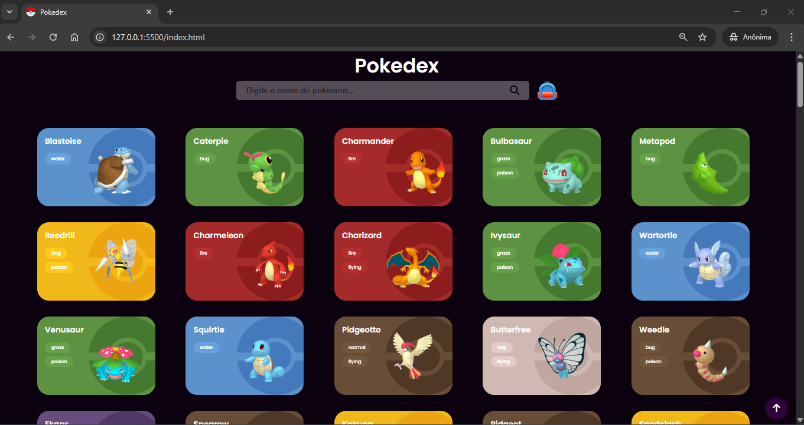

# 📘 Pokedex


Uma aplicação web interativa inspirada no universo Pokémon, desenvolvida com o objetivo de **treinar e aprimorar conhecimentos em HTML, CSS, JavaScript e consumo de APIs**.  
O projeto exibe uma lista de Pokémons com informações básicas, imagens ilustrativas e filtros de busca.

---

## 🎯 Objetivo do Projeto

Este projeto foi desenvolvido como prática de:

- Consumo e manipulação de dados de uma API.
- Organização e modularização de código JavaScript.
- Estilização de interfaces com CSS/SASS.
- Implementação de recursos interativos (busca, favoritos, armazenamento local).
- Boas práticas de versionamento e documentação.

---

## 🛠️ Tecnologias Utilizadas

- **HTML5** → Estrutura da aplicação.
- **CSS3 / SASS** → Estilização responsiva e moderna.  
- **JavaScript (ES6+)** → Lógica da aplicação.  
- **LocalStorage** → Persistência de favoritos.  
- **PokéAPI** → Fonte de dados sobre os Pokémons.  

---

## 🖼️ Interface

A interface foi projetada para ser intuitiva e atrativa, exibindo os Pokémons em cards coloridos conforme seus tipos.  

### Exemplo da Interface



---

## ⚙️ Funcionalidades

- 🔎 **Busca por nome** de Pokémon.  
- ❤️ **Favoritar Pokémons** com armazenamento no navegador.  
- 🎨 **Cards estilizados** de acordo com o tipo do Pokémon.  
- 📱 **Design responsivo** para diferentes dispositivos.  

---

## 🚀 Como Executar o Projeto

1. Clone este repositório:

   ```bash
   git clone https://github.com/seu-usuario/pokedex.git

2. Acesse a pasta do projeto:

    ```bash
    cd pokedex

3. Abra o arquivo index.html no navegador ou utilize a extensão Live Server no VS Code.

---

📌 Melhorias Futuras

- Paginação para exibir mais Pokémons.
- Mais detalhes ao clicar em um Pokémon (status, habilidades, evoluções).
- Animações e microinterações para enriquecer a experiência.

---

👨‍💻 Autor

- Otimizado neste repositório por Alex Menezes.
- Este projeto faz parte do meu portfólio de estudos.
- Sinta-se à vontade para contribuir ou deixar sugestões!

---

📜 Licença

- Este projeto pode ser utilizado e adaptado livremente para fins educacionais e corporativos.
- Copyright (c) 2025 Alex Menezes - Pokedex
